# Measuring Coffee Grind Size with a Phone Camera and a Piece of Paper

> A proof-of-concept for affordable, repeatable coffee grind size analysis using computer vision.

## TL;DR

A printed reference sheet, a phone camera with flash, and a Python script can measure coffee grind size with **Pearson r = 0.99** against known grind settings and **< 5% variation** between repeated photos. No ML, no GPU, no special equipment — just classical computer vision (adaptive threshold + watershed) running in under a second per image.

*Particle size distributions shift clearly between grind settings:*

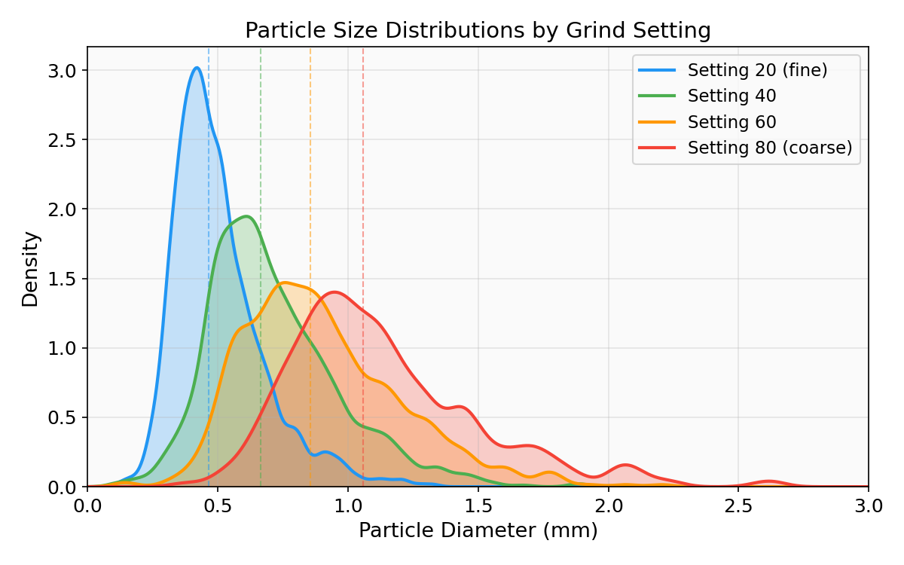

**Key findings:**
- Median particle diameter tracks grind setting nearly perfectly (r = 0.989 with flash)
- Within-setting coefficient of variation averages 4.6% across 16 photos
- Flash is critical — without it, monotonic ordering breaks and correlation drops to 0.854
- Classical watershed beats Cellpose (deep learning) in both accuracy and speed (30× faster, higher r)

The full pipeline is in [`src/`](src/) — run it in **report mode** to estimate grind size from any photo (`--report`), or in **batch mode** with labelled photos to compute correlation statistics.

*Sample output for a setting-40 grind:*

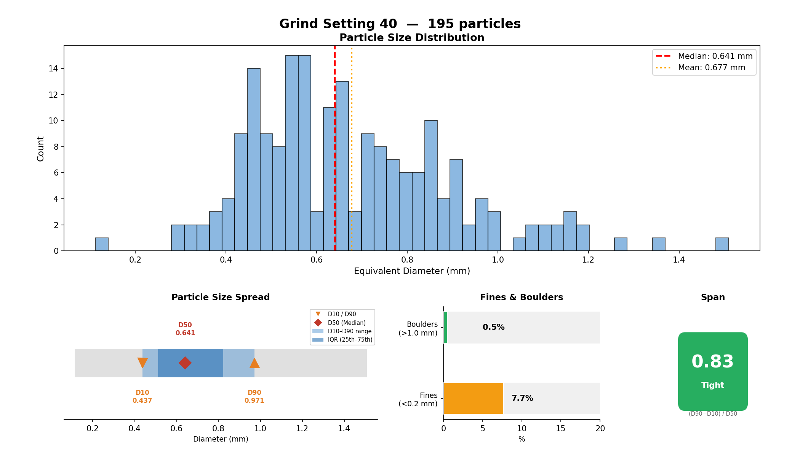

---

### Contents

1. [Introduction — Why Grind Size Matters](#introduction--why-grind-size-matters)
2. [The Reference Sheet — Establishing Scale](#the-reference-sheet--establishing-scale)
3. [The Pipeline — From Photo to Measurements](#the-pipeline--from-photo-to-measurements)
4. [What We Tried — The Road to r = 0.95](#what-we-tried--the-road-to-r--095)
5. [The Effect of Lighting — Flash vs. No Flash](#the-effect-of-lighting--flash-vs-no-flash)
6. [Pipeline Visualisation](#pipeline-visualisation)
7. [How Well Does It Work?](#how-well-does-it-work)
8. [What's Next](#whats-next)
9. [Disclaimer & Hardware](#disclaimer--hardware)

---

## Introduction — Why Grind Size Matters

Grind size is arguably the single most important variable in coffee extraction. Too fine, and your espresso chokes; too coarse, and your pour-over tastes thin and sour. Professional coffee labs measure grind distributions with laser diffraction analysers or calibrated sieve stacks — tools that cost thousands of euros and are entirely impractical for home use.

We wanted to find out: **can a phone photo and some basic computer vision give us meaningful, repeatable particle size measurements?** Not lab-grade precision, but enough to compare grinders, track dial-in changes, and notice when something is off.

Our setup is deliberately minimal: a smartphone camera, a sheet of paper printed on a home printer, and a Python script. No special lighting, no microscope, no GPU required.

## The Reference Sheet — Establishing Scale

The first thing we needed was a way to go from "pixels in a photo" to "millimetres in the real world." We designed a simple reference sheet: a piece of white paper with four ArUco markers (machine-readable square codes) printed at known positions.

*The reference sheet with ArUco markers at four corners and a note box:*

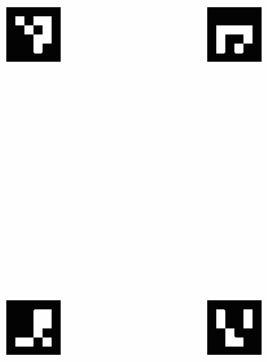

The four markers form a rectangle of known dimensions (55 × 80 mm between centres). When we take a photo — from any angle, any distance — we detect these four markers, compute a perspective transform, and warp the image to a perfect top-down view at a fixed resolution of 20 pixels per millimetre (50 µm per pixel). This gives us absolute physical scale without needing to measure anything by hand.

In practice, we spread a thin layer of coffee grounds on the white area between the markers, snap a photo with a phone, and the software handles the rest.

*Coffee grounds spread on the reference sheet:*

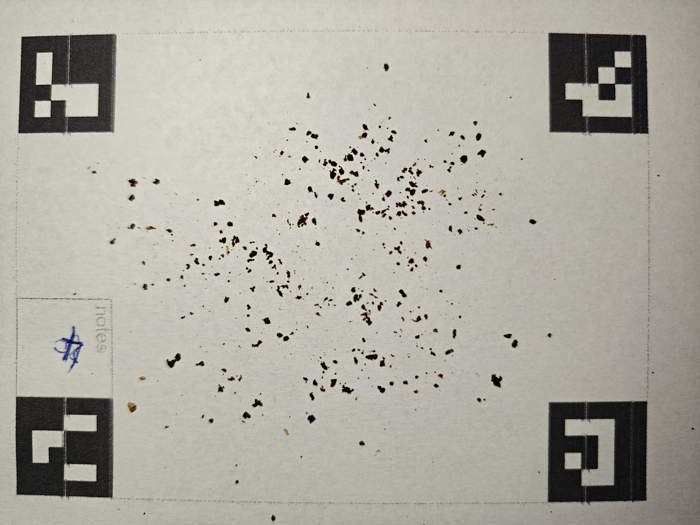

## The Pipeline — From Photo to Measurements

Our analysis pipeline runs in five steps:

### 1. Detect & Warp

We find the four ArUco markers in the photo and compute a homography to warp the image to a canonical 1400 × 1900 pixel rectangle. This corrects for perspective, rotation, and any angle the photo was taken from.

*Original photo → Warped top-down view:*

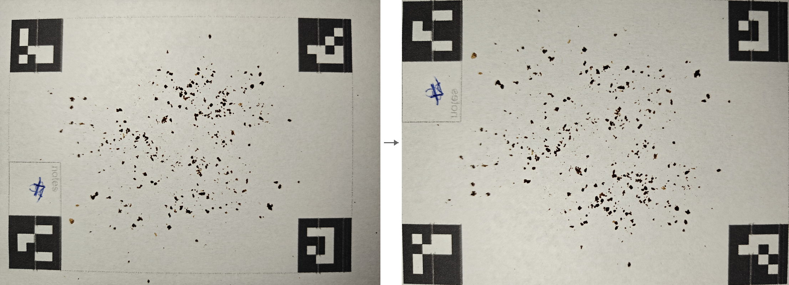

### 2. Normalise

The warped image is white-balance corrected using the markers themselves as reference: the marker interiors provide a black point, and the paper borders provide a white point. Each colour channel is linearly stretched so that lighting differences between photos are neutralised.

*White-balance normalised image:*

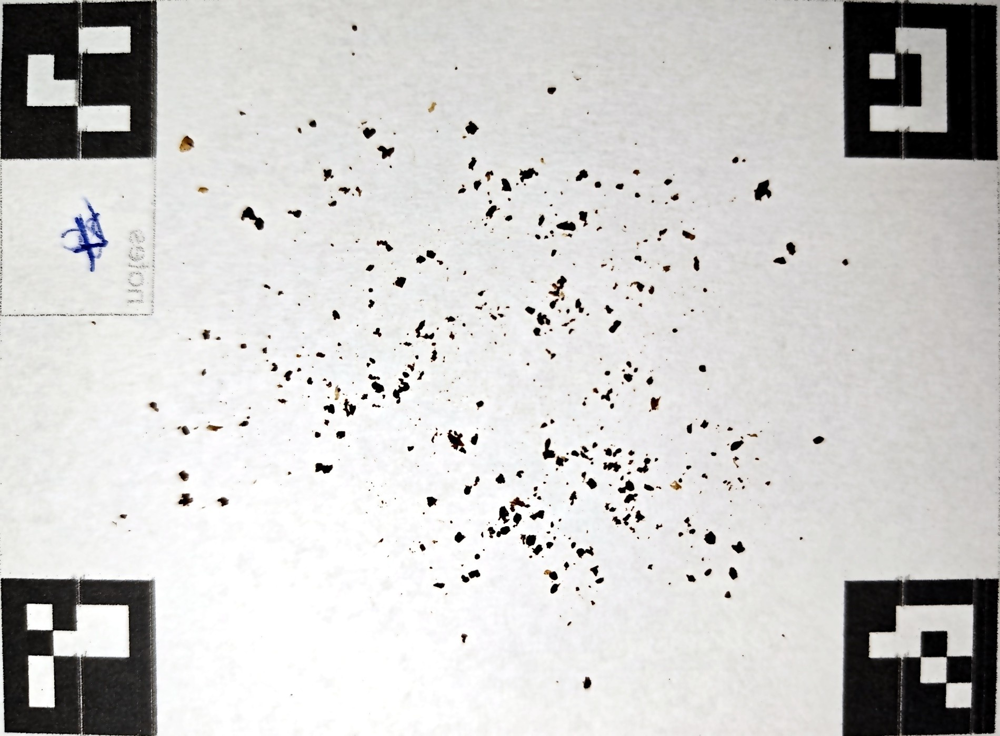

### 3. Segment

This is where we separate individual coffee particles from the white paper background. We tried several approaches (more on that below), but our final pipeline uses classical computer vision:

- **Adaptive thresholding** on a combined channel (inverted lightness + colour saturation) to create a binary mask of "particle vs. paper"
- **Morphological clean-up** (opening and closing) to remove noise
- **Distance transform** to find the centre of each particle
- **Watershed algorithm** to split touching particles along their boundaries

*Adaptive threshold → Distance transform → Watershed seeds:*

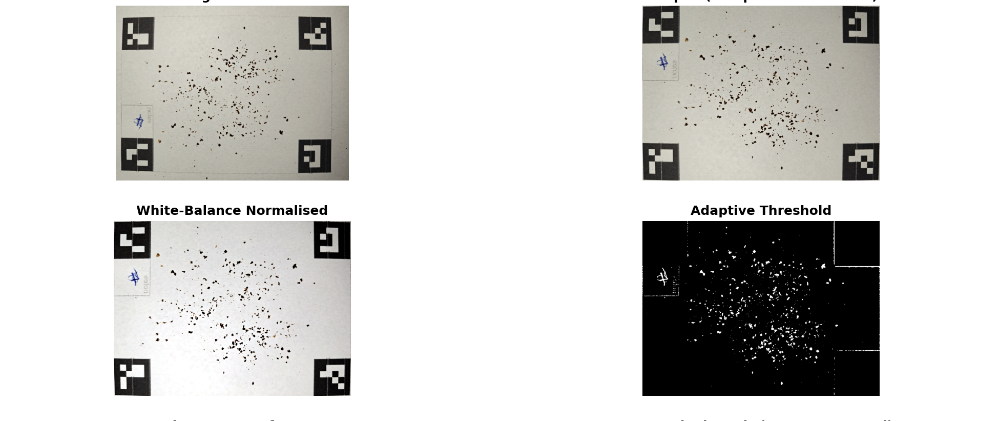

### 4. Measure

For each segmented particle, we compute its area in mm², equivalent circular diameter, major/minor axis lengths, eccentricity, and solidity. Particles that overlap with the marker zones or that are too bright (paper grain artefacts) are automatically filtered out.

We also compute industry-standard distribution statistics: D10/D50/D90 percentiles, span (distribution width), fines percentage (< 0.200 mm), boulders percentage (> 1.000 mm), volume-weighted mean diameter D[4,3], and surface-weighted mean diameter D[3,2].

### 5. Visualise

We generate an overlay showing each detected particle coloured and outlined, plus a histogram of the particle size distribution.

*Segmentation overlay with detected particles:*

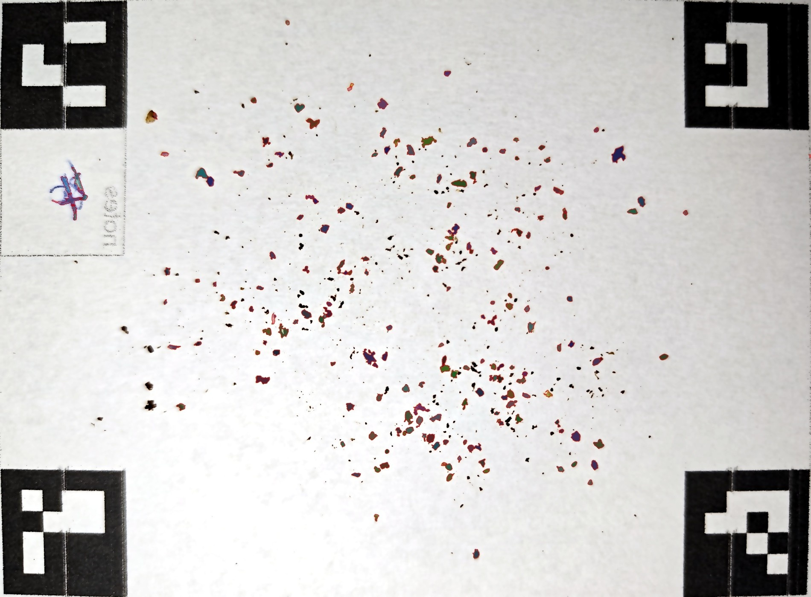

*Particle size distribution histogram with visual gauges:*

## What We Tried — The Road to r = 0.95

We didn't arrive at our final pipeline on the first attempt. Here's the chronological story of what we tried, what failed, and what stuck.

### Starting Point: Cellpose (ML-Based Segmentation)

Our first instinct was to use [Cellpose](https://www.cellpose.org/), a state-of-the-art deep learning model for instance segmentation. It's designed for biological cells — round-ish objects on a contrasting background — which sounded a lot like coffee particles on white paper.

We inverted the image (dark particles become bright objects on dark background, matching the model's expectation) and ran the `cyto3` model with a GPU. Cellpose *found* particles, but its size tracking was poor. We ran both models head-to-head on 5 flash photos spanning all four grind settings:

| Grind Setting | Watershed: Median (mm) | Cellpose: Median (mm) | Watershed: Particles | Cellpose: Particles |
|--------------|----------------------:|-----------------------:|--------------------:|-------------------:|
| 20 (fine)    | 0.489                 | 0.550                  | 689                 | 1078                |
| 40           | 0.682                 | 0.643                  | 246                 | 450                 |
| 60           | 0.830                 | 0.679                  | 182                 | 331                 |
| 80 (coarse)  | 1.093                 | 0.716                  | 131                 | 442                 |
| 80 (coarse)  | 1.050                 | 0.660                  | 101                 | 317                 |

The numbers tell the story. Watershed median sizes span **0.49–1.09 mm** across grind settings — a clear, monotonically increasing trend (Pearson r = 0.995). Cellpose medians barely move: **0.55–0.72 mm**, a compressed range that fails to differentiate coarse from fine (r = 0.875, and monotonicity breaks between settings 60 and 80).

Cellpose also found far more "particles" — roughly 2× more at every setting. Many of these are false splits of single particles into multiple fragments, or noise detections in the paper texture. This over-segmentation is what compresses the median downward for coarser grinds.

On top of accuracy, there's the speed difference:

| Model | Mean time per image | Hardware | Pearson r |
|-------|-------------------:|----------|----------:|
| **Watershed** | **0.19 s** | CPU only | **0.995** |
| Cellpose (cyto3) | 5.9 s | GPU (RTX 3060 Ti) | 0.875 |

Watershed is **~30× faster** and doesn't need a GPU — and it correlates better with grind settings. We kept Cellpose as a comparison baseline but moved forward with watershed as our primary pipeline.

### The Classical Baseline: Watershed

We implemented a classical computer vision pipeline — adaptive threshold plus watershed — as a "sanity check" baseline. To our surprise, it immediately outperformed our expectations:

- **Pearson r = 0.837** (correlation between grind setting and median particle size)
- **Mean CV = 14.0%** (variation between 4 photos of the same grind setting)

Not perfect, but clearly tracking grind size. The correlation was strong enough to be useful. Could we push it higher?

### Iteration 1: h-Maxima Peak Detection — ❌ Failed

Our first optimisation attempt replaced the global distance-transform threshold with h-maxima filtering from scikit-image. The idea was to find local peaks in the distance map more robustly.

**Result: catastrophic.** Pearson r collapsed from 0.837 to 0.250. The h-maxima approach found too many noise peaks, fragmenting real particles into tiny shards. The median sizes for settings 40, 60, and 80 all collapsed to nearly identical values around 0.4 mm. We reverted immediately.

### Iteration 2: Adaptive Threshold Sweep — ✅ Kept

Instead of guessing parameters, we ran a systematic sweep across 36 combinations of block size (31–81) and threshold constant C (-5 to -15) for the adaptive thresholding step.

**Winner: blockSize = 71, C = -8.** This single change lifted Pearson r from 0.837 to **0.923** — a substantial jump from tuning just two parameters.

### Iteration 3: Distance Fraction Sweep — ✅ Kept

We then swept the distance-transform threshold (the fraction of the maximum distance used to identify "sure foreground" peaks). The original value of 0.25 meant most of the particle interior was considered foreground, leading to under-segmentation of touching particles.

**Winner: dist_frac = 0.40.** This pushed Pearson r to **0.953** and reduced within-setting CV from 14.0% to 11.1%.

### Iteration 4: Mahalanobis Colour Pre-Segmentation — ❌ Failed

We tried replacing our simple lightness + saturation combination with a more sophisticated Mahalanobis distance in LAB colour space, using the paper background as a reference distribution. The idea was to better separate brown coffee from beige paper.

**Result:** r dropped from 0.953 to 0.941, and the approach also introduced instability in multi-threaded processing. We reverted.

### Iteration 5: Size-Adaptive Morphology — ➖ No Effect

We swept various combinations of morphological kernel sizes and channel weights. After testing dozens of configurations, none improved on our current settings. The pipeline was already near-optimal for these parameters.

### Iteration 6: Density Normalisation — ➖ No Effect

We investigated whether uneven particle density across photos (coverage ranged from 1% to 4.5%) was biasing measurements. Analysis showed no systematic correlation between density and measurement error. No correction needed.

### The Takeaway

**Simple parameter tuning beat sophisticated algorithmic changes.** Our two successful optimisations (threshold sweep and distance fraction) were both straightforward numerical sweeps over existing parameters. The more "clever" approaches — h-maxima peak detection, Mahalanobis colour modelling — either failed catastrophically or showed no improvement.

| Step | Method | Pearson r | CV | Outcome |
|------|--------|-----------|----|---------|
| Baseline | Default parameters | 0.837 | 14.0% | Starting point |
| 1 | h-maxima watershed | 0.250 | — | ❌ Reverted |
| 2 | Threshold sweep (blockSize=71, C=-8) | 0.923 | — | ✅ Kept |
| 3 | Distance fraction (0.40) | 0.953 | 11.1% | ✅ Kept |
| 4 | Mahalanobis colour | 0.941 | 11.7% | ❌ Reverted |
| 5 | Morphology tuning | 0.953 | 11.1% | ➖ No change |
| 6 | Density normalisation | 0.953 | 11.1% | ➖ No change |

## The Effect of Lighting — Flash vs. No Flash

Beyond tuning the algorithm, we wanted to understand how much *lighting* matters. We photographed the same grind settings twice: once with the phone's flash, once without. Same pipeline, same code — only the light source changed.

| Metric | No flash (4 photos) | With flash (16 photos) |
|--------|--------------------:|----------------------:|
| **Pearson r** | 0.854 | **0.989** |
| **Mean CV** | — | **4.6%** |
| **Monotonic ordering** | ❌ Broken | ✅ Correct |

The difference is stark. Without flash, Pearson r drops to 0.854 and — critically — the monotonic relationship between grind setting and measured size **breaks**: setting 80 (0.848 mm) is measured as *smaller* than setting 60 (0.949 mm). With flash, every grind setting correctly measures larger than the one below it.

| Grind Setting | No flash: Median (mm) | Flash: Median (mm) | Flash: CV |
|--------------|----------------------:|--------------------:|----------:|
| 20 (fine)    | 0.508                 | 0.456               | 6.0%      |
| 40           | 0.702                 | 0.675               | 3.9%      |
| 60           | 0.949                 | 0.844               | 7.1%      |
| 80 (coarse)  | 0.848 ⚠️              | 1.057               | 1.5%      |

Why does no-flash fail? Without the flash, the camera compensates with a longer exposure and higher ISO, introducing motion blur and sensor noise. Shadows from ambient lighting create uneven illumination across the reference sheet, and warm or cool colour casts shift the threshold boundary between "paper" and "particle." Our white-balance normalisation step helps, but it cannot fully correct for harsh shadows or colour gradients across the image.

With flash, within-setting CV averages just **4.6%** across the four grind settings (with four photos each). This means four photos of the same grounds typically agree within ±5%.

**Recommendation: always use flash.** It's the single easiest thing you can do to improve measurement quality — and without it, the results may not even be monotonic.

*Flash vs No-Flash accuracy and precision comparison:*

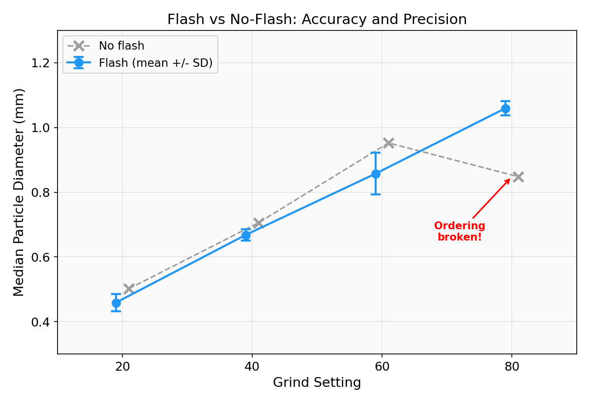

### Particle Counts

| Grind Setting | No flash | Flash (avg of 4) |
|--------------|--------:|---------:|
| 20 (fine)    | 394     | ~494     |
| 40           | 177     | ~235     |
| 60           | 191     | ~151     |
| 80 (coarse)  | 111     | ~121     |

Particle counts generally decrease with coarser grind settings — exactly what we'd expect physically. Finer grounds produce more, smaller particles. The no-flash set's setting-60 count (191) being higher than its setting-40 count (177) likely reflects the same illumination issues that caused its median size inversion.

## Pipeline Visualisation

For each photo, we generate a summary image showing every stage of the pipeline. Here's an example at grind setting 40:

*Full pipeline summary for a single photo:*

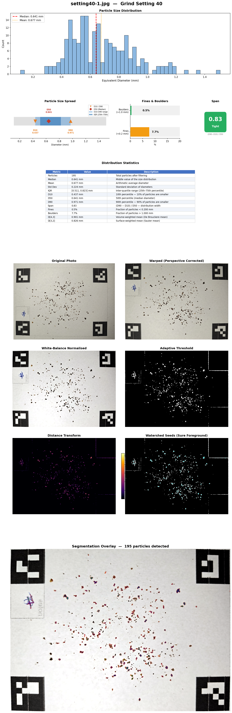

The summary shows:
1. **Size distribution histogram** with median and mean lines
2. **Visual gauges** — D10–D90 range bar, fines/boulders percentage bars, and a span badge
3. **Distribution statistics table** — all key metrics with descriptions
4. **Original photo** → **Warped** (perspective corrected)
5. **Normalised** (white-balance corrected) → **Binary threshold** (particle vs. paper)
6. **Distance transform** → **Watershed seeds** (cyan dots marking each particle's centre)
7. **Segmentation overlay** (each particle coloured and outlined)

## How Well Does It Work?

To put the numbers in context:

- **Pearson r = 0.99** means grind setting explains about 98% of the variance in measured particle size. When you turn the grinder coarser, we measure bigger particles — reliably, every time.

- **CV = 4.6%** (with flash) means if you take 4 photos of the same grounds, the median sizes will typically agree within ±5%. Some of that variation is real (the grounds aren't perfectly homogeneous), and some is measurement noise.

- **Size range**: we measure from about 0.46 mm (setting 20, a fine filter grind) to 1.06 mm (setting 80, a coarse French press grind). These values are physically plausible for the DF54 grinder we used.

*Particle size distributions by grind setting:*

*Violin plot of particle diameters by grind setting:*

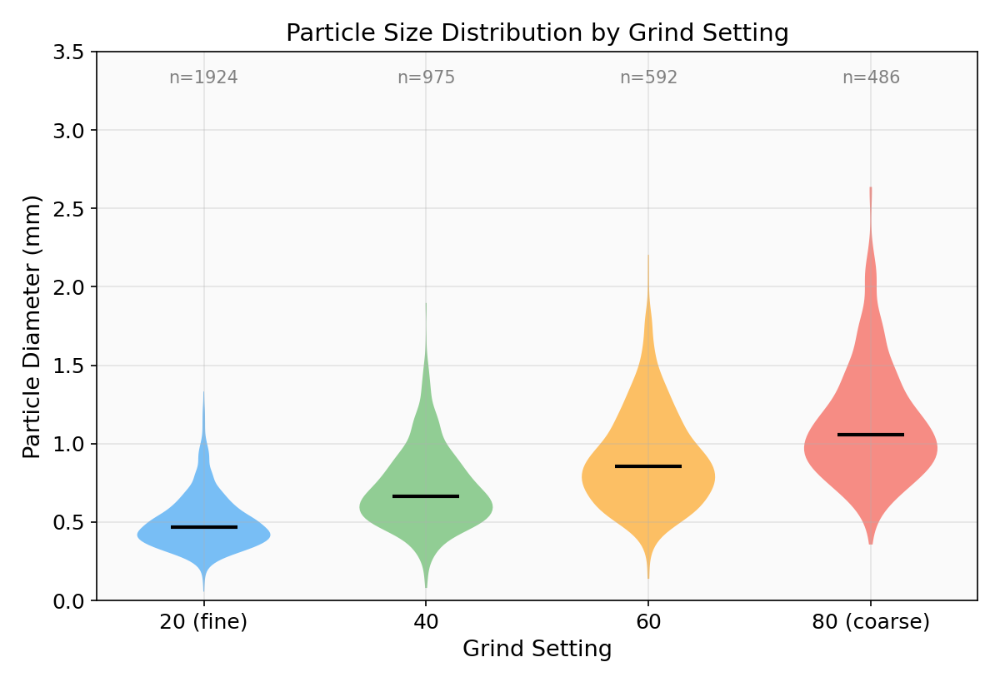

This is not a laser diffraction analyser. We can't resolve individual particles below ~100 µm, and touching or overlapping particles can be under-segmented. But for comparing grind settings, tracking grinder dial-in, or verifying that your grinder is producing consistent output — it works.

## What's Next

This was a proof of concept. Several directions could take it further:

- **Phone app**: wrap the pipeline in a mobile app with live camera preview and on-device processing
- **Fines detection**: the current system struggles with very fine espresso grinds (< 200 µm) near the pixel resolution limit; higher-resolution photos or macro lenses could help
- **Grinder comparison**: use the tool to objectively compare different grinders or burr sets
- **Validation against sieve analysis**: correlate our optical measurements with traditional sieve-based particle size distributions

## Conclusion

A printed reference sheet, a phone camera, and a few seconds of classical computer vision processing can reliably measure coffee grind size with a Pearson correlation of 0.95–0.99 against known grind settings. No machine learning, no GPU, no special equipment beyond a home printer.

The biggest practical finding: **use your flash**. Without it, measurement variability climbs and the size ordering can actually break — in our no-flash test, the coarsest setting measured *smaller* than the second-coarsest. With flash, every setting lands in the correct order and within-setting CV drops below 5%.

---

## Disclaimer & Hardware

We're coffee enthusiasts, not data scientists. This project was a weekend proof-of-concept, not a peer-reviewed study. The statistics are real, but the experimental design is informal — we didn't control for ambient temperature, humidity, grind retention, or dozens of other variables a proper study would account for.

**Hardware used:**
- **Grinder:** DF54 single-dose — a budget (~€100) entry-level flat burr grinder. Results will vary with other grinders.
- **Phone:** OnePlus 13R — a mid-range Android phone. Any phone with a decent camera and flash should work.
- **Processing:** Python 3.14, OpenCV, scikit-image. No GPU needed (though we tested Cellpose on an RTX 3060 Ti for comparison).

**AI-assisted development:** This project was built with significant help from AI. We used **Claude Opus 4.6**, **GPT-5.3**, and **GPT-5.3-Codes** to iterate on the computer vision pipeline, debug code, analyse results, and write this writeup. The AI didn't collect the data or make the coffee — but it did most of the coding and all of the prose drafting.
